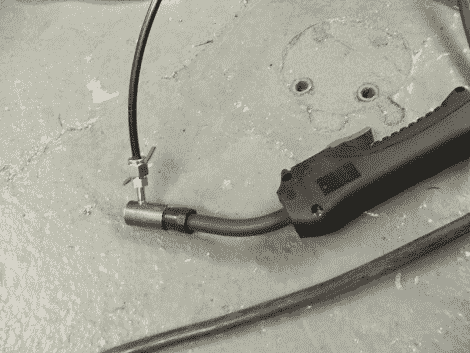

# 药芯焊丝到 MIG 焊机的转换

> 原文：<https://hackaday.com/2010/04/23/flux-cored-to-mig-welder-conversion/>

[Rob]给我们发了一些关于他如何将他的药芯焊机转换成金属惰性气体焊机的信息。他用一根 DOM 管作为夹头，带有一根侧进气管，用来注入二氧化碳。气体来源于一个 12 盎司的油漆球二氧化碳罐，它看起来像是在夹头的连接处有一个阀门。我们想知道需要多长时间来撕裂这些坦克，但如果你不做大量的 MIG 焊接，这就节省了购买单独设置的前期成本。