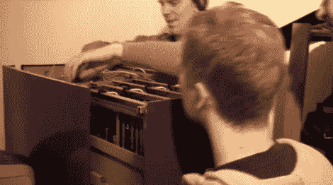

# 在文件柜中渲染和混合

> 原文：<https://hackaday.com/2010/04/24/rendering-and-blendering-in-a-file-cabinet/>

Blender 基金会刚刚收到了一个新的渲染农场。它以四抽屉文件柜的形式出现，类似于流行的[宜家集群](http://hackaday.com/2008/05/25/ikea-linux-cluster/)。每个抽屉可容纳四块主板、电源和硬盘，整个机柜最终将组成一个 16 节点集群。休息后观看送货和拆包视频，加入极客的兴奋行列。我们喜欢 T4 的组织分享他们使用的硬件的细节。 <https://www.youtube.com/embed/8eWJs9pygwU?version=3&rel=1&showsearch=0&showinfo=1&iv_load_policy=1&fs=1&hl=en-US&autohide=2&wmode=transparent>

 </body> </html>