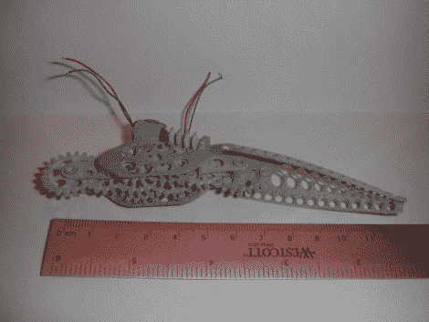

# 带两个接头和集成电机的可印刷附件

> 原文：<https://hackaday.com/2010/04/26/printable-appendage-with-two-joints-and-integrated-motors/>

[克里斯·里德] [开发了这个机器人附肢](http://blog.krisreed.com/2010/04/3d-printed-robotic-arm-draft-2/)，作为他的[原始原型](http://blog.krisreed.com/2010/02/3d-printing-of-mechanical-parts/)的后续。他用混合了铝粉的可打印材料[铝化物](http://www.shapeways.com/blog/archives/384-A-new-3D-printing-material-Alumide.html)打印出来。[Kris']设计采用三种齿轮类型；大齿轮、小齿轮和蜗轮。电机安装在组件的中间部分，并提供肘部和肩部类型的设置，两者沿同一平面旋转。休息之后我们有测试的视频。他注意到运动有点不平稳，但可以通过使用 PWM 进行更好的电机控制来清理。

 <https://www.youtube.com/embed/UstKPkLowdA?version=3&rel=1&showsearch=0&showinfo=1&iv_load_policy=1&fs=1&hl=en-US&autohide=2&wmode=transparent>

 </body> </html>