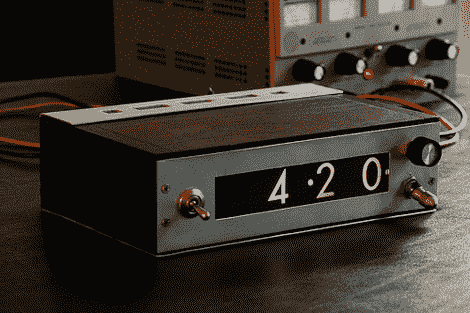

# IEE 时钟

> 原文：<https://hackaday.com/2010/04/27/iee-clock/>

第一眼看上去，这个时钟有点不寻常。但是仔细观察，你会发现每一个数字对应 12 个[灯泡。灯泡位于一个弯曲的透镜后面，透镜上有数字。当相应的灯点亮时，它会将数字投射到时钟的正面。虽然它不是新的，但对我们来说肯定是新的。同样有趣的是，你可以通过旋转右上方的小转盘来设置时间。虽然这样设置时间可能更容易，但似乎容易受到意外的推动。](http://www.decadecounter.com/vta/articleview.php?item=509)

[通过[黑客日 Flickr 池](http://www.flickr.com/photos/tubetime/4552589731/in/pool-76206823@N00)