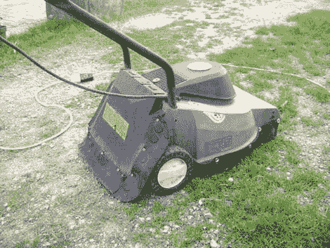

# 割草机改装成锄头/铲运机

> 原文：<https://hackaday.com/2010/04/27/lawnmower-converted-to-hoescraper/>

[Torx]写了这篇关于如何将剪草机转换成另一个有用工具的[说明书。我们不确定他的母语是什么语言，但我们怀疑是英语，所以你最好看看照片，看看他在做什么。总而言之，他放下了割草机，把刀片反过来刮地。他还在四周增加了厚厚的橡胶边缘，以防止碎片出来。你可能想知道为什么他会需要这样的东西，但最后一页总结得很好。我们可以想象这也可能在花园中得到一些应用。虽然这个看起来很危险，但是如果你切掉了一只手或者因为一些碎片失去了一只眼睛，不要责怪我们。话说回来，普通的割草机看起来也很危险。](http://www.instructables.com/id/Lawnmover-becomes-a-superficial-motorized-hoe/)