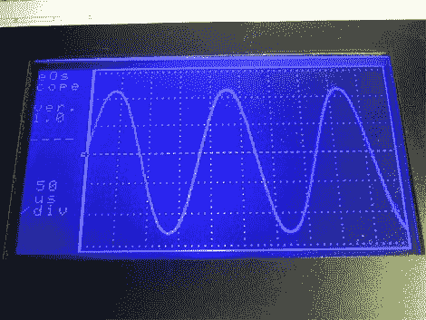

# 40 MSPS 数字示波器

> 原文：<https://hackaday.com/2010/04/27/40-msps-digital-oscilloscope/>

如果你可以在家里制作单面电路板[你就可以制作这个数字示波器](http://www.eosystems.ro/eoscope/eoscope_en.htm)。它主要使用通孔元件，只有几个表面贴装芯片与之抗衡。ATmega162 处理硬件方面的事情，CPLD 用于管理采样率。数据显示在 240×128 的液晶显示器上，这是最昂贵的部件。即使你[得到一个基本模型并破解它以解锁所有功能](http://hackaday.com/2010/03/31/update-50mhz-to-100mhz-scope-conversion/)，它仍然比购买一个商用示波器便宜得多。

[谢谢胡安]