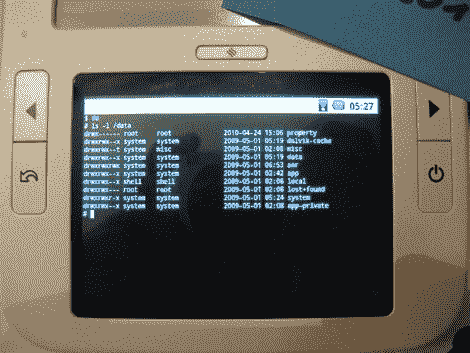

# 我是 Root！亚历克斯·艾瑞德

> 原文：<https://hackaday.com/2010/04/27/i-am-root-alex-ereader/>

亚历克斯·电子书阅读器已经扎根于此。这个[的小掌上电脑](https://www.springdesign.com/us/index.action)是 2010 年 CES 展会上电子书阅读器的焦点。现在，它已经被释放到野外，它的位置就在已经看到根访问的重量级人物[旁边。如果你不熟悉，这款设备拥有 6 英寸的电子墨水显示屏和 320×240 液晶触摸屏界面。现在你可以让它为你服务了，你对 350 美元的平板电脑有什么计划？请在评论中告诉我们。](http://hackaday.com/2009/12/23/nook-rooted-without-being-opened/)

[谢谢理查德]