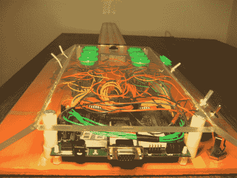

# 一半是街机，一半是吉他

> 原文：<https://hackaday.com/2010/04/28/part-arcade-part-guitar/>

终于有了一把所有街机游戏迷都能玩的吉他。[迈克·达文波特]送给我们他的 8 位街机吉他作为他的毕业设计。如果你打算在此刻建造自己的，细节有点稀疏，但他确实提到了基础:例如它使用一个 [FPGA](http://hackaday.com/?s=fpga) 进行逻辑和功能，字符串和操纵杆修改音高，它有可选的波形和其他参数，甚至包括储蓄银行！休息过后，看看他扮演街头霸王的视频。

[https://www.youtube.com/embed/kMh4YndbzHU?version=3&rel=1&showsearch=0&showinfo=1&iv_load_policy=1&fs=1&hl=en-US&autohide=2&wmode=transparent](https://www.youtube.com/embed/kMh4YndbzHU?version=3&rel=1&showsearch=0&showinfo=1&iv_load_policy=1&fs=1&hl=en-US&autohide=2&wmode=transparent)