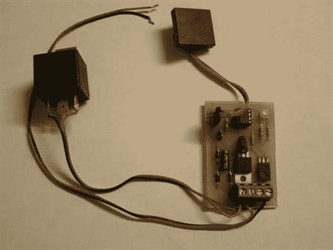

# RFID 防盗系统

> 原文：<https://hackaday.com/2010/04/28/rfid-immobiliser/>

[andrew_h]为他的汽车安装了这个精巧的防盗装置。 [RFID 防盗器](http://www.instructables.com/id/RFID-Car-immobiliser-with-PIC12629/)用于防止汽车启动，除非你刷 RFID 标签。取决于你隐藏的有多好，以及偷车的人对你的了解程度，他们没有理由怀疑他们必须要刷标签。即使有人在车还在运行的时候偷了车，如果他们关掉引擎，他们也不能重新启动引擎。和往常一样，原理图和 PCB 都有。