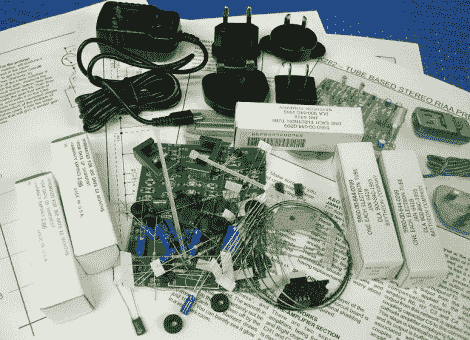

# 耳机管前置放大器套件

> 原文：<https://hackaday.com/2010/05/03/headphone-tube-preamp-kit/>

如果你对电子管放大器感到好奇，但没有足够扎实的知识基础去钻研，你可能想尝试一套工具。[马克·休斯顿] [回顾了一个这样的工具包](http://diyaudioprojects.com/Tubes/6418-Tube-Phono-Preamp-Kit/)，我们喜欢阅读他的经历。除了焊接工具、外壳和最终连接器([Mark]使用 RCA 连接器)，它还提供了您需要的一切。有一个完整的原理图可用，组装说明带你通过管匹配，并使用你在图片中看到的铜线圈片缠绕自己的电感。在你开始建造一个[单管](http://hackaday.com/2010/04/13/tiny-tube-amp-for-headphones/)、[多管](http://hackaday.com/2009/10/23/poddwatt-tube-amp-with-mp3-in-mind/)或者你自己设计的放大器之前，考虑尝试一下这个初级产品。

[谢谢吉奥]