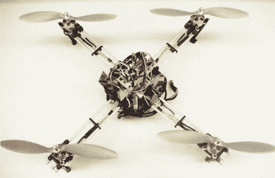

# 双足飞龙四轴飞行器

> 原文：<https://hackaday.com/2010/05/03/wyvern-quadcopter/>

[William Etter]和他的同学[建造了一架四轴飞行器作为班级项目](http://wyvernupenn.blogspot.com/)。我们喜欢这些构建的细节，他们通过了一些彻底的文档。我们喜欢的一些亮点是阅读[的 ABS 车身设计](http://wyvernupenn.blogspot.com/2010/04/mechanical-design.html)和构造，他们的[对两个与三个叶片螺旋桨的分析](http://wyvernupenn.blogspot.com/2010/04/mechanical-design.html)，以及他们的[试验控制机制](http://wyvernupenn.blogspot.com/2010/04/controller.html)。你可以在最近的帖子中看到他们的成功，但我们都知道试错在这些构建中起着重要作用，所以我们很高兴他们与我们分享了一系列崩溃。

看不够这个四旋翼动作？查看[这个类似设计](http://hackaday.com/2010/01/15/aeroquad-build-your-own-quadcopter/)的项目。