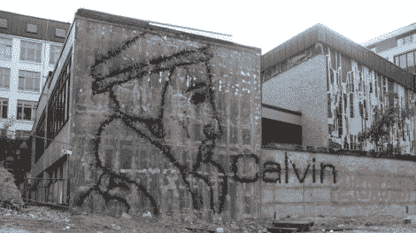

# 彩弹涂鸦

> 原文：<https://hackaday.com/2010/05/04/paintball-graffitti/>

彩弹作为大幅面打印机？这正是[门面打印机](http://www.abitare.it/highlights/facade-printer/)的作用。彩弹枪安装有两个可控制的运动轴。计算机读入图像数据，并通过发射彩弹将其打印出来，形成点阵显示。这里有几个优点，彩弹颜料可以洗掉，这将在粗糙或不均匀的显示介质上工作。休息之后，请观看印刷过程的视频。

如果你已经[建造了你自己的彩弹炮塔](http://hackaday.com/2009/08/03/paintball-turret-plans-released/)，给其他人一个机会，把它打印出来，而不是射杀毫无防备的对手。

[https://player.vimeo.com/video/7299485](https://player.vimeo.com/video/7299485)

[感谢 Jollygreengiant]