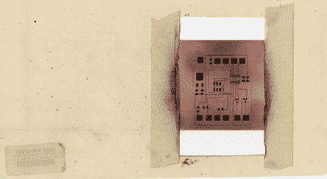

# 将碳粉直接打印到 PCB 上

> 原文：<https://hackaday.com/2010/05/04/print-toner-directly-to-a-pcb/>

我们使用墨粉转移法制造印刷电路板。其中最困难的部分是印刷、熨烫和从用作抗蚀剂材料的墨粉中去除纸张。[Mark Lerman]正在开发一种方法，使用激光打印机将墨粉直接涂在覆铜板上。他画廊里的每张照片都有注释，带我们了解他的过程。一台激光打印机被改造成带负电的铜板，从而吸引带正电的色粉。一旦调色剂已被应用，董事会是在烤箱烘烤，然后通过层压机运行。这种工艺可以产生 2 密耳的走线，看起来难以置信的干净电路板的潜力就在眼前。问题是，这是否会比使用光刻胶更简单、耗时更少？

我们已经联系了[马克],希望得到更多的细节。如果你等不及后续报道，[看看这个关于他工作的帖子](http://tech.groups.yahoo.com/group/Homebrew_PCBs/message/25560)。

[感谢 komraddob]