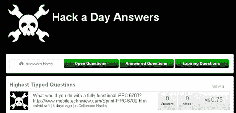

# Answers.hackaday.com 正在直播

> 原文：<https://hackaday.com/2010/05/04/answers-hackaday-com-is-live/>

快，去[answers.hackaday.com](http://answers.hackaday.com)注册一个账户。几年前，[我们宣布](http://hackaday.com/2009/11/04/hack-a-day-into-the-future/)我们将为 Hackaday 带来一个社区驱动的问答系统。我们最终厌倦了等待这个功能的出现，于是[即兴创作了](http://hackaday.com/2010/03/21/ask-hackaday-now-a-regular-occurrence/)。好了，等待结束了。您现在可以发布自己的问题和答案。发疯吧，发帖吧，但记得要尊重。我们仍在摸索这个系统，所以也请耐心等待。

请注意，我们会非常严格地对待钓鱼。

值得注意的是，有一个货币系统融入其中。这意味着你可以为你问题的答案提供真正的奖励。你当然不需要这么做。