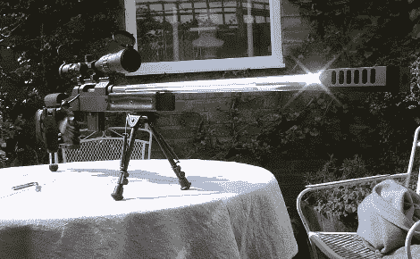

# 疯狂机械师杰作

> 原文：<https://hackaday.com/2010/05/05/mad-machinist-masterpieces/>

如果一张图片抵得上 1000 字，根据我们的统计，[ [瑞安·科姆贝斯](http://homepage.ntlworld.com/ryan.coombes/) ]对 1.68×10^6 的定制[机器人](http://www.ukmonsters.co.uk/robocain/robocain.html)、气枪[怪物卡车](http://www.ukmonsters.co.uk/2009website/mainpage.html)的建造说过不同的话。虽然我们不是挑选最喜欢的人，但我们一致认为他的 [Alpine TPG-1](http://www.ukmonsters.co.uk/Unique%20Alpine%20Build%20Pics/Candymans%20airsoft%20Unique%20Alpine%20TPG-1%20build.htm) (图片在顶部)比其他人更胜一筹。遗憾的是，论坛[和他的构建日志似乎没有加载，但他说如果你想自己制作，基本过程是收集图片、测量和创建。](http://www.airsoftcommunity.co.uk)

[谢谢安德鲁]