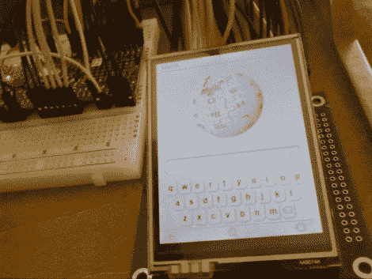

# 建立你自己的维基百科阅读器

> 原文：<https://hackaday.com/2010/05/06/build-your-own-wikipedia-reader/>

一部分是廉价的 uC，一部分是触摸屏，一部分是互联网知识库，所有这些加在一起构成了这个维基百科阅读器。它的功能与[商业版本](http://hackaday.com/2009/10/13/100-portable-wikipedia/)非常相似，通过解析流行网站的 XML 转储到 SD 卡上，以便在设备上使用。这不仅限于维基百科，也可以很容易成为电子阅读器。[Rossum]使用恩智浦 ARM Cortex M0 型号 LCP1114 微控制器开发了该封装。它们的价格只有几美元，但却拥有 50 MHz 的穿孔频率、32 KB 的程序内存和 8 KB 的 SRAM。如果 [nanotouch](http://hackaday.com/2010/01/27/nanotouch-a-tiny-avr-media-thing/) 和[A](http://hackaday.com/2010/01/27/nanotouch-a-tiny-avr-media-thing/)VR iPhone 概念没有让你相信【罗森】知道他在做什么，那么这款最新产品发布后的视频将会敲定这笔交易。

 <https://www.youtube.com/embed/tUmCOaxk6oY?version=3&rel=1&showsearch=0&showinfo=1&iv_load_policy=1&fs=1&hl=en-US&autohide=2&wmode=transparent>

 </body> </html>