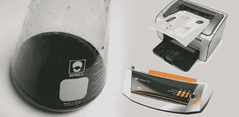

# 逐步解释碳粉转移

> 原文：<https://hackaday.com/2010/05/07/toner-transfer-explained-step-by-step/>

[Tanjent]给我们发一个链接，链接到他关于制作电路板的墨粉转移过程的教程。我们过去已经见过很多这样的例子，但我们喜欢他开门见山的方式，同时也分享了一些技巧和选择。值得注意的是，他在试图通过涂抹一点蚀刻剂将墨粉附着在覆铜板上之前，先给覆铜板“上色”。他的理由是墨粉更难粘在闪亮的铜上。只要一点蚀刻剂就会使表面凹陷，让墨粉粘得更好。

他仍然使用纸张作为媒介，而不是直接将墨粉打印到覆铜板上。他选择的纸张是惠普宣传册用纸，而我们用的是联合报纸的光面纸。但是和我们一样，他也使用氯化铜作为腐蚀剂，你可以[学着自己制作](http://www.instructables.com/id/Stop-using-Ferric-Chloride-etchant!--A-better-etc/)。我们仍在寻找处理这种化学物质的最终解决方案。我们多年来一直使用同一批产品，但最近它因有杂质而变得浑浊。如果你有处理垃圾的建议，让我们在评论区听听吧。