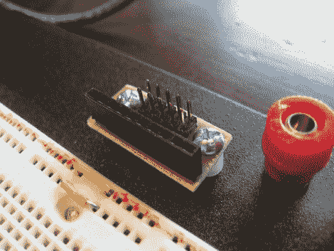
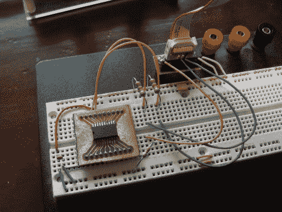
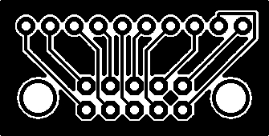

# 5×2 接线板

> 原文：<https://hackaday.com/2010/05/07/5x2-patch-board/>

有时我们想坐在后门廊，喝点啤酒，做些原型制作。其他时候，我们想做同样的事情，但在客厅的沙发上。为此，我们在无焊试验板上增加了一个 5×2 引脚到 10×1 引脚的接线板。

5×2 引脚外形非常常见，在龙骑士 500 和 STK 500 等开发板以及 Bus Pirate 等小型原型器件中用作 AVR 编程接口。我们喜欢使用 IDC 电缆作为互连的自由，这就是该板的用武之地。现在，我们可以接入 IDC 电缆，但在转移到不同的原型制作地点时，仍然可以快速断开它们。休息之后，请查看 PCB 插图和这个正在使用的便捷设备。

上面是我们不久前制作的 [DS3232 分线板](http://hackaday.com/2010/04/29/surface-mount-breakout-boards/)的图像。[我们有探针电缆](http://hackaday.com/2009/07/02/how-to-bus-pirate-probe-cable/)，可以用来直接连接分线板上的引脚，但正如你所看到的，在这个电路中我们需要一个平滑电容和三个上拉电阻，所以我们使用试验板。过去，我们将跳线直接连接到 IDC 电缆的一端，但很难确保连接正确，电线经常会松脱。将我们的新型分线板连接到试验板上，可以实现与 10×1 引脚插座的可靠连接，同时保持 5×2 引脚接头的便携性。

如果你想让你自己的，PCB 作品在下面。我们使用 6-32 机械螺钉、尼龙垫片、垫圈、锁紧垫圈和螺母将 PCB 牢牢固定在我们在试验板基座上钻的孔中。祝你好运，并让我们知道你如何喜欢这一补充。

