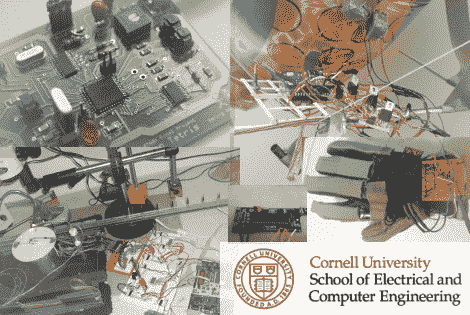

# 康奈尔大学最终项目清单

> 原文：<https://hackaday.com/2010/05/08/cornell-final-project-list/>

使用 Atmel Mega644 寻找有趣的项目？康奈尔大学的学生已经覆盖了你。他们被要求使用微控制器选择、设计和构建一个项目；而今年很有希望的有[视频物体追踪](http://instruct1.cit.cornell.edu/courses/ee476/FinalProjects/s2010/aip23_kaf42/aip23_kaf42/index.html)，一直受欢迎的[特雷姆斯](http://instruct1.cit.cornell.edu/courses/ee476/FinalProjects/s2010/dl346_swj4/dl346_swj4/4760_Final.htm)，[直升机](http://instruct1.cit.cornell.edu/courses/ee476/FinalProjects/s2010/jk483_ksd28_zkd2/jk483_ksd28_zkd2/index.html)，[恒电位仪](http://instruct1.cit.cornell.edu/courses/ee476/FinalProjects/s2010/esf59_akh75/esf59_akh75/index.html)，甚至[巴甫洛夫条件蚊子](http://instruct1.cit.cornell.edu/courses/ee476/FinalProjects/s2010/der34_jhp35_ksm38/der34_jhp35_ksm38/index.html)，等等。

当然，所有以前的年份也包括在内，总共超过 350 个项目。

[感谢布鲁斯·兰德]