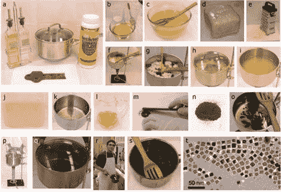

# 制造磁铁矿纳米晶体

> 原文：<https://hackaday.com/2010/05/08/making-magnetite-nanocrystals/>

与我们在这里发布的许多化学项目不同，[制造磁铁矿纳米晶体](http://opensourcenano.net/projects/project1/)不需要任何在当地杂货店找不到的东西。所有需要的是油，醋，水晶排水开启器，和铁锈。我们不知道他们使用的排水管清洁剂的具体品牌，但我们确信你可以找到一种成分相同的。磁铁矿纳米晶体用于去除水中的砷。如果你在美国或欧洲大部分地区，这不是一个大问题，但它不会伤害你，不是吗？

[通过[使](http://blog.makezine.com/archive/2010/05/open_source_nanotechnology_make_mag.html)