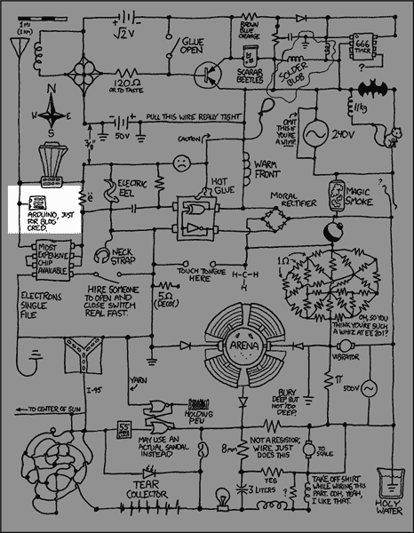

# XKCD 在 Arduino 上挥了一下

> 原文：<https://hackaday.com/2010/05/08/xkcd-takes-a-swipe-at-the-arduino/>

这部 XKCD 漫画俏皮地刷了一下几乎所有东西，包括 Arduino。我们听到有人声称我们对 Arduino 有某种偏爱，我们没有。人们只是提交了很多项目。但有一点，我们已经见过几次，应该得到解决。在我们的类别中，我们有一个“Arduino hacks”部分。这种情况不会消失，因为我们收到了太多的申请。然而，难道我们不应该为其他东西添加一些类别吗？是否应该有一个“pic 黑客”的类别，或者仅仅是“微控制器黑客”的类别？

让我们不要让这成为一个 Arduino 攻击线程。相反，给我们一些你想看到的其他分类的好主意。

[via [littlebirdceo](http://twitter.com/littlebirdceo/statuses/13409314937)