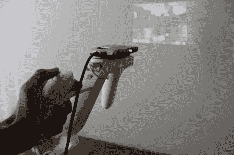

# FPS 控制器破解变得更容易

> 原文：<https://hackaday.com/2010/05/10/fps-controller-hacks-getting-easier/>

它曾经是一个主要的产品，以建立一个枪形式的 FPS 控制器，但商业技术已经采用了许多这些年来的传统黑客。现在，[Nirav Patel]正在用 Wii zapper 和 space point 玩 Cube。要做到这一点，真正需要的是对开源 FPS[魔方](http://cubeengine.com/cube.php4)的补丁。

[Nirav]计划使用一个猎兔犬板使这个控制器无线化。我们想知道是否支持使用 Wii motion plus？我们已经看到了 [motion plus Arduino 连接](http://hackaday.com/2009/06/23/wii-motionplus-arduino/)，以及[直接 PC 连接](http://hackaday.com/2010/02/01/wii-motion-plus-direct-pc-interface/)。Wii 遥控器[已经连接到 Linux](http://hackaday.com/2009/11/28/how-to-use-wiimotes-w-linux/) ，那么从蓝牙连接下载数据呢？如果你已经这样做了，[给我们发送一个关于它的提示](http://hackaday.com/contact-hack-a-day/)。