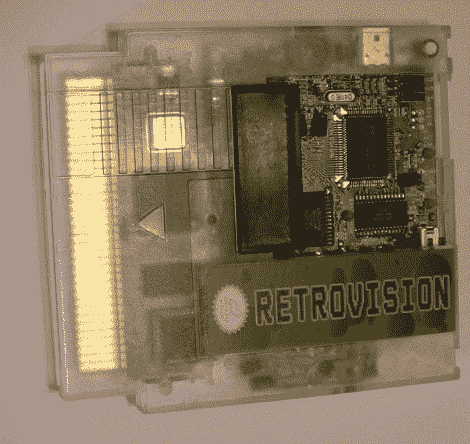

# 原来 NES 玩 Game Boy 游戏？

> 原文：<https://hackaday.com/2010/05/11/original-nes-plays-game-boy-games/>

[兔子男孩]用这个[定制的 NES 子弹](http://nintendoage.com/forum/messageview.cfm?StartRow=1&catid=6&threadid=32896)完成了一些魔法。里面是一个游戏男孩的主板，以及他自己定制的 PCB，带有与最初的任天堂娱乐系统接口所需的梳状连接器。用他自己的话说，这是“一个没有超能力的超级游戏男孩”。掌上电脑的扩展端口仍可用于一些面对面的俄罗斯方块，或用于不起眼的 Game Boy 打印机。

[谢谢 Maxym]