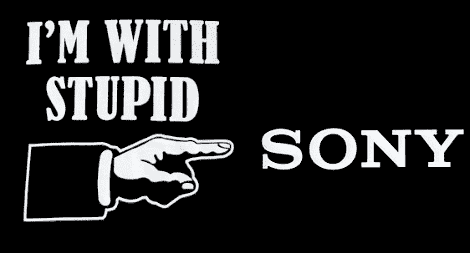

# PS3 补丁允许 Linux 安装

> 原文：<https://hackaday.com/2010/05/11/ps3-patch-allows-linux-installation/>

【Geohot】想出了[一个补丁，允许其他 OS 在 3.21 PS3 固件上](http://geohotps3.blogspot.com/2010/04/otheros-supported-on-321oo.html)。你会记得[索尼发布了 3.21 版本专门禁止其他操作系统](http://hackaday.com/2010/03/31/sony-removes-ps3-linux-support-with-an-update-errrrr-downgrade/)允许安装 Linux，而[他们随后因此被起诉](http://hackaday.com/2010/04/29/sony-removes-ps3-linux-support-gets-sued-for-it/)。好吧，现在他们的“修复”对那些愿意刷新补丁固件的人不起作用了，这意味着他们只是在惩罚那些遵守规则的人。呃。

想知道为什么这是一件大事吗？查看这篇关于[索尼此举对用于超级计算的 PS3 集群的影响的文章](http://nexus404.com/Blog/2010/05/07/sony-accidentally-ends-ps3-supercomputing-sonys-removal-of-the-otheros-feature-prematurely-ends-ps3-supercomputer-clusters/)；一些我们最初甚至没有想到的事情。

原来这个补丁是一个多月前发布的。抱歉报道晚了，但这对我们来说是新的。休息之后你可以看到打了补丁的 OtherOS 的必录证明视频。

 <https://www.youtube.com/embed/1-9wLWQ4-uA?version=3&rel=1&showsearch=0&showinfo=1&iv_load_policy=1&fs=1&hl=en-US&autohide=2&wmode=transparent>

 
[谢谢 Wdfowty]
 </body> </html>