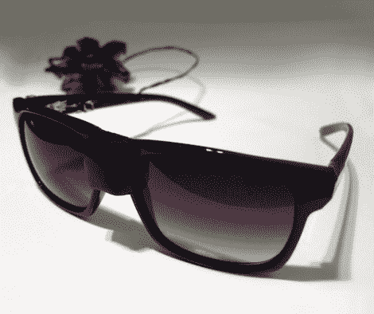

# 用你的太阳镜监测紫外线照射

> 原文：<https://hackaday.com/2010/05/12/monitor-uv-exposure-with-your-sunglasses/>

厌倦了那些可怕的晒伤？【Nikko Knappe 的】[紫外线感应眼镜](http://www.nikoknappe.com/works/uvsunglasses/#)会在你变得像龙虾一样又脆又红之前发出警告。添加到桥支撑的凸起隐藏了 TSL230R 光频率传感器。当手臂展开时，设备会自动打开，并开始跟踪累积曝光。如果它检测到紫外线水平上升，或者根据皮肤类型你即将被灼伤，镜架一个臂内的 LED 将会闪烁通知你。

如果你认为[大卫·布瑞恩的地球](http://en.wikipedia.org/wiki/Earth_%28novel%29)描绘了气候变化将会如何发展，这是有潜力的。不管怎样，这仍然很有趣，我们给[Nikko]加分，因为他把控制它的 lilypad 伪装成了一个花发夹。