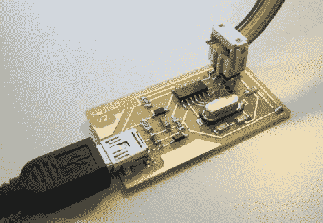

# 极简 AVR 程序员只是 Fab！

> 原文：<https://hackaday.com/2010/05/15/minimalist-avr-programmer-is-just-fab/>

无论您是在 Arduino 板上烧录新的引导程序，还是放弃引导程序直接刷新 Atmel 芯片，系统内程序员(ISP)都是使用 AVR 微控制器不可或缺的工具。如果成本阻碍了你，它不再是一个借口: [FabISP](http://fab.cba.mit.edu/content/projects/fabisp/index.html) 是一个基于 USB 的 AVR 编程器的准系统，大约十美元就可以组装起来。

FabISP 由[David Mellis]创建，是麻省理工学院 [Fab Lab](http://fab.cba.mit.edu/) 项目的产品，该项目为学校提供了基于一套核心[制造](http://hackaday.com/2009/03/16/cupcake-cnc-kit/) [能力](http://hackaday.com/2009/09/19/reprap-milling-machine/)的设计和制造工具，因此世界各地的实验室可以共享成果。但是 FabISP 的设计非常简单，你不需要整个 fab 实验室。这是一块小型的单面电路板，不需要[钻孔](http://hackaday.com/2010/03/18/pcb-drill-press-on-a-budget/)；这些部件都是表面贴装[的](http://hackaday.com/2010/04/29/surface-mount-breakout-boards/)，但间距并没有细到需要[回流焊](http://hackaday.com/2009/01/16/pid-smd-reflow-hot-plate/)的程度。轻松点。

当然，还有一个引导问题:你需要一个 AVR 程序员来把固件安装到 FabISP 上。对于一个[黑客空间](http://hackaday.com/2010/02/02/minneapolis-hackerspace-twin-cities-maker/)、俱乐部或学校来说，这将是一个优秀的团队项目:如果一个人可以提供最初的[程序员](http://hackaday.com/2009/11/18/pic-powered-avr-programmer/)来闪存几块板，每个成员可以[蚀刻](http://hackaday.com/2010/05/07/toner-transfer-explained-step-by-step/)和[组装](http://hackaday.com/2009/10/13/how-to-populate-a-surface-mount-pcb/)他们自己的，让它被编程，然后把这些带到世界上来帮助创造更多。*我们必须重复！*

[谢谢胡安]