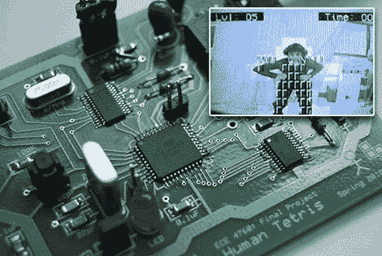

# 人类俄罗斯方块:8 位微控制器上的目标跟踪

> 原文：<https://hackaday.com/2010/05/15/human-tetris-object-tracking-on-an-8-bit-microcontroller/>

详细阐述上周末康奈尔大学期末项目清单中提到的一个项目，这次是通过视频:

在他们的 ECE 最终项目中，[Adam Papamarcos]和[Kerran Flanagan]实现了一个以 ATmega644 8 位微控制器为中心的实时视频对象跟踪系统[。他们的主板接收 NTSC 视频摄像头输入，以 39×60 像素的分辨率对帧进行采样(足够简单的游戏使用)，处理输入以识别物体，然后使用视频摄像头的 OSD 显示芯片驱动电视输出(该芯片还可以识别输入视频信号中的水平和垂直同步脉冲，CPU 使用这些脉冲来同步数字化步骤)。到处都是令人惊叹的作品。](http://instruct1.cit.cornell.edu/courses/ee476/FinalProjects/s2010/aip23_kaf42/aip23_kaf42/index.html)

有时网上聪明的项目缺乏信息…但是因为这是他们的最终成绩，他们没有留下任何细节来猜测。除了对该系统及其具体挑战的精彩解释，还有完整的源代码、原理图、零件清单等全部内容。来吧伙计们。你让我们其他人看起来很糟糕…休息后的视频…

[你好，布鲁斯]

基本目标跟踪:

 <https://www.youtube.com/embed/f8cdfxDv__Y?version=3&rel=1&showsearch=0&showinfo=1&iv_load_policy=1&fs=1&hl=en-US&autohide=2&wmode=transparent>

 
人类俄罗斯方块:
 <iframe class="youtube-player" width="800" height="480" src="https://www.youtube.com/embed/uz-x-QW69co?version=3&amp;rel=1&amp;showsearch=0&amp;showinfo=1&amp;iv_load_policy=1&amp;fs=1&amp;hl=en-US&amp;autohide=2&amp;wmode=transparent" allowfullscreen="true" style="border:0;" sandbox="allow-scripts allow-same-origin allow-popups allow-presentation"/> 
碎砖机:
 <iframe class="youtube-player" width="800" height="480" src="https://www.youtube.com/embed/xTw4dH2l7YE?version=3&amp;rel=1&amp;showsearch=0&amp;showinfo=1&amp;iv_load_policy=1&amp;fs=1&amp;hl=en-US&amp;autohide=2&amp;wmode=transparent" allowfullscreen="true" style="border:0;" sandbox="allow-scripts allow-same-origin allow-popups allow-presentation"/> </body> </html>