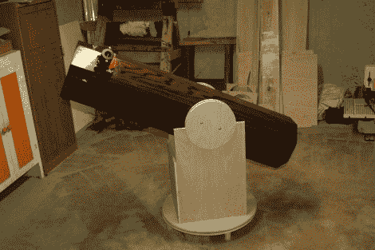

# 建造一个橡树望远镜

> 原文：<https://hackaday.com/2010/05/17/building-an-oak-telescope/>

你可能不会考虑自制望远镜的表面，但如果它是由实心橡木制成的，你可能应该考虑。[Gregory Strike] [几年前建造了这个 8 英寸的望远镜](http://www.gregorystrike.com/?p=53),但是几天前才刚刚发布。光学是相当昂贵的，但其余的建设做得非常便宜，他做了一个伟大的工作。这包括小心处理构成乐器八角形主体的橡木板。

对于普通黑客来说，这比类似于 [22”双筒望远镜建造](http://hackaday.com/2008/12/09/22-binocular-telescope/)(或者走得太远，让[建造自己的天文台](http://hackaday.com/2008/07/31/russian-homemade-telescope/))要容易得多。[Gregory]在看了几个其他人的设计后开发了他的设计。如果你需要一点推动来开始[，看看我们在互联网初期遇到的望远镜资源](http://hackaday.com/2005/08/06/build-your-own-telescope/)。