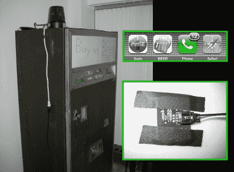

# 老派自动售货机学新花样

> 原文：<https://hackaday.com/2010/05/17/old-school-vending-machine-learns-new-tricks/>

多亏了 craigslist，克里斯在 1977 年左右得到了一台汽水自动售货机。它仍然工作得很好(因为当时的东西仍然可以持续使用),但他想给饮料店增加一些超级秘密的升级。增加了两个电容式触摸传感器，以满足那些知道在哪里抚摸野兽的人对硬币的需求，iPhone 支持意味着泡沫啤酒只需触摸一下。

电容开关使用的是我们去年在《生命游戏》中看到的相同的 QT100 芯片。整个事情是由一块菲戈兹板控制的，我们过去见过[用 iPhone 控制发射火箭](http://hackaday.com/2009/12/24/missile-command-on-iphone-with-real-missiles/)。休息后，观看片段中的功能演示。我们很想这样做，但问题是一旦你完成了，你的房子里就有一台自动售货机。

 <https://www.youtube.com/embed/ba27y4_NDo4?version=3&rel=1&showsearch=0&showinfo=1&iv_load_policy=1&fs=1&hl=en-US&autohide=2&wmode=transparent>

 </body> </html>