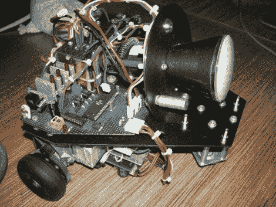

# 阴极射线管在这个机器人上领先

> 原文：<https://hackaday.com/2010/05/18/cathode-ray-tube-leads-the-way-on-this-bot/>

[Daqq]的最新创造是这个小的[机器人，它的前端安装了一个 CRT 显示器](http://daqq.eu/index.php?show=prj_retrobot)。显然是“为什么？”这是一个错误的问题，但我们知道这是他的拿手好戏，考虑到他对这种不太常见的[等离子球数码管](http://hackaday.com/2009/09/15/nixie-plasma-ball/)。这个结实的机器人使用两个步进电机控制的轮子和前面的全向轮来创建三轮车。ATmega128 控制系统，但这里真正的故事是 CRT。它需要一个强大的电压调节器，用于 Tungsram DG7-123 电子管所需的-600V 至+200V 电压。一路上的麻烦从处理电源的杂散磁场，到安装脆弱的电子管本身。看看上面链接的他的详细文章，休息后加入我们的演示视频。

 <https://www.youtube.com/embed/iKLxOsPKuAs?version=3&rel=1&showsearch=0&showinfo=1&iv_load_policy=1&fs=1&hl=en-US&autohide=2&wmode=transparent>

 <iframe class="youtube-player" width="800" height="480" src="https://www.youtube.com/embed/Pxs6NJi0ONU?version=3&amp;rel=1&amp;showsearch=0&amp;showinfo=1&amp;iv_load_policy=1&amp;fs=1&amp;hl=en-US&amp;autohide=2&amp;wmode=transparent" allowfullscreen="true" style="border:0;" sandbox="allow-scripts allow-same-origin allow-popups allow-presentation"/> </body> </html>