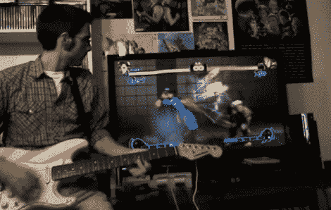

# 粉碎成街头霸王

> 原文：<https://hackaday.com/2010/05/19/shredding-to-street-fighter/>

弹奏出拳，换品移动，[艾伦·查塔姆] [用他的吉他演奏《街头霸王》](http://www.openchord.org/2010/04/street-fighter/)。它被修改成使用 [OpenChord](http://www.openchord.org/) ，一个他开发的开源吉他控制器包。这原本是为了与吉他英雄之类的一起使用，但正如他在休息后的视频中提到的那样，它是开源的，所以你可以用它做任何你想做的事情。在这种情况下，他修补到 PS3 中，展示了在该控制台上使用您自己的硬件的另一种方法。不像[替代的类似吉他的界面](http://hackaday.com/2010/01/20/hey-man-ssh-to-my-guitar-and-setup-the-multitouch/)你不必重新学习如何演奏。你只需要调整你最喜欢的歌曲，以符合踢屁股控制器组合。对于喜欢冒险的人来说[你可以自己制作](http://www.openchord.org/building-developing/)，但是【艾伦的】也有可用的套件。 <https://www.youtube.com/embed/JLUZwqRv3OE?version=3&rel=1&showsearch=0&showinfo=1&iv_load_policy=1&fs=1&hl=en-US&autohide=2&wmode=transparent>

 </body> </html>