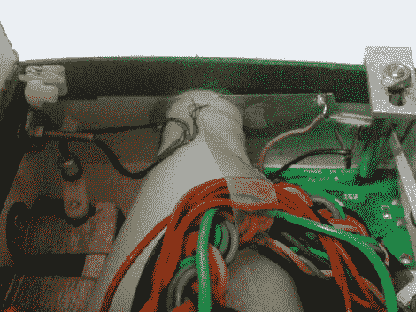

# 自动喂鱼机

> 原文：<https://hackaday.com/2010/05/20/automatic-fish-feeder/>

这个[自动喂鱼器](http://picasaweb.google.com/gaganchd2000/AutoFishFeeder#)没花多长时间就组装好了，它可以让你调整食物的分配量。[Gagandeep Singh]围绕 Atmel AT89C2051 微控制器构建了它。像我们看到的许多[自动喂食系统](http://hackaday.com/2010/01/31/recycled-cat-feeder/)一样，它使用字符显示和几个按钮作为用户界面。我们总是好奇他们是如何机械地分配食物的。在这种情况下，左边看到的电机拉开一个滑动挡板，该挡板被右边的橡皮筋再次拉开关闭。它比我们看到的最后一个喂鱼器的[要复杂一点，但是你的猜测和我们的一样，哪个系统工作得更好。](http://hackaday.com/2008/07/20/simple-fish-feeder/)