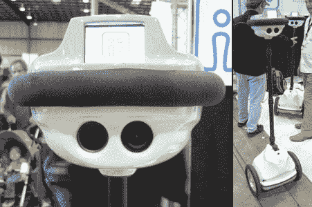

# BAMF2010: QB 去开会，从眼睛射出激光

> 原文：<https://hackaday.com/2010/05/24/bamf2010-qb-goes-to-meetings-shoots-lasers-from-eyes/>

不，这不是《瓦力》*“QB”是硅谷公司 [Anybots](http://anybot.com/) 的最新远程呈现机器人。QB 结合了双向视频会议和一个 [Segway](http://hackaday.com/2009/10/20/well-engineered-diy-segway/) 风格的自平衡平台。这个想法是提供移动性和比桌面会议更自然的交互。*

 *这个 35 磅重的机器人的电池可以运行 6 到 8 个小时，伸缩式头部可以调节眼睛的高度，以符合用户的自然视角。看起来像立体视觉的东西实际上是左眼上的一个摄像头和右眼上的一个可操纵的激光指示器。

QB 将于今年 10 月以 15，000 美元的价格上市，它将主要吸引那些有特殊网真需求的企业。这是他们之前的 *QA* 模型价格的一半——并且随着时间的推移，这项技术可能会达到大众市场的水平。在那之前，我们只能自娱自乐，用我们的 T4 机器人远程参加会议。*