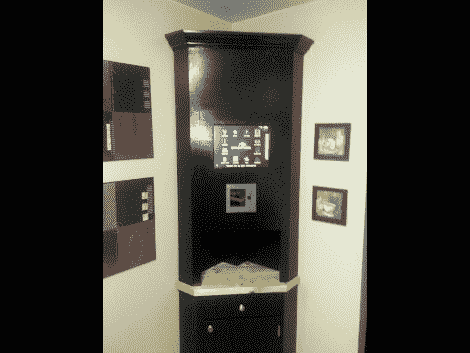

# 将 HAL 打造成为你的厨房

> 原文：<https://hackaday.com/2010/05/24/build-hal-into-your-kitchen/>

Gojimi 没有将一台价值 500 美元的 iPad 组装成一个橱柜，而是用他闲置的旧硬件组装了这台厨房电脑。他确实买了一些东西，如二手触摸屏和条形码扫描仪，但 2 GHz 的电脑只是落满灰尘。它运行 Windows XP，像[哈尔](http://en.wikipedia.org/wiki/HAL_9000)或[凯特](http://en.wikipedia.org/wiki/KITT)一样与你交谈，并在你将食物放入餐具室或使用食物时扫描食物上的条形码。休息后的冗长视频涵盖了所有的功能，如体重观察者的计算，食物信息，食谱，单位转换器，天气预报，浏览器和数码相框。它似乎比类似 iPhone 厨房的[有更多的功能，但它看起来也非常复杂。但我们还是想要一个。](http://hackaday.com/2010/01/23/iphone-look-alike-on-your-kitchen-wall/)

<https://player.vimeo.com/video/11757390>

 </body> </html>