# 2010 年海湾地区制造商博览会图片

> 原文：<https://hackaday.com/2010/05/24/bay-area-maker-faire-2010-in-pictures/>

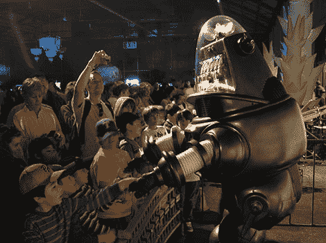

就在你认为事情不可能变得更大、更疯狂的时候，他们又成功超越了自己。[湾区创客节](http://hackaday.com/2010/05/21/bay-area-maker-faire-blasts-off-saturday/)于周日晚上结束，但我们有太多的故事线索，我们可能会一直忙到明年的活动。与此同时，这里只是一个微小的，随机抽样的数不清的乐趣，迎接游客在过去的周末。

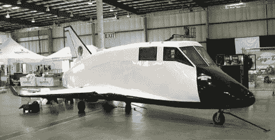

在亚轨道旅游太空竞赛中，准备日是我们唯一一次可以清晰拍摄到赫尔墨斯航天飞机参赛的机会。

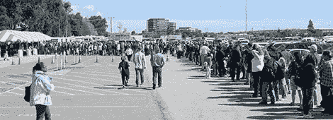

周六清晨，这条线延伸到无限远处。

在游乐场的另一边，许多当地人利用免费的自行车代客服务，获得了 5 美元的门票折扣。这个视图只显示了大约一半的自行车！我们只发现一辆[横卧在外面](http://hackaday.com/2009/09/01/zelo-the-improbable-wooden-trike/)停在这里，但有不少在里面作为制造商展品。

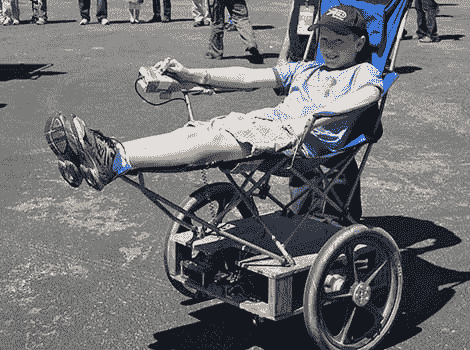

走了这么多路！这个孩子有一个正确的想法，在奢华中四处滑行。

在最初的[狗食店老板](http://www.roadsideamerica.com/story/11504)出现之前，这不是一个海湾地区的派对！

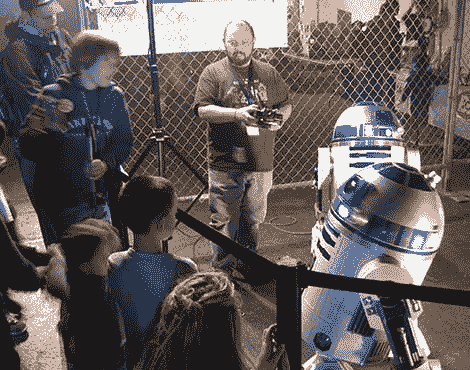

今年机器人到处都是 T2。当然， [R2 建筑者俱乐部](http://www.artoo-detoo.net/)也在现场…

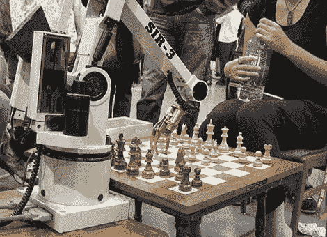

…但是没有伍基人在场和这个机械臂下棋。

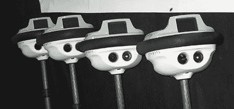

一排 [Anybots](http://hackaday.com/2010/05/24/bamf2010-qb-goes-to-meetings-shoots-lasers-from-eyes/) ，都准备好担负起自己[霸主](http://hackaday.com/2009/10/06/atv-brings-skynet-closer/)的职责。

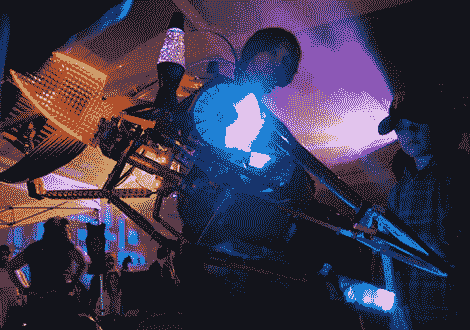

我们最喜欢的长颈鹿加入了狂欢，带着它的新电子头。

蒙多蜘蛛就像它较小的生物灵感一样，设法同时具有迷人和潜在的致命性。然而，它一点也不安静。

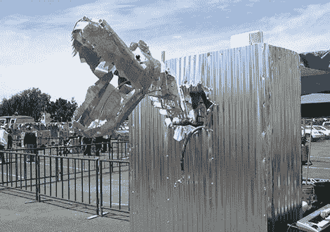

回到外面，这个由[迷笛](http://hackaday.com/2010/05/12/midi-gloves/)控制的[气动](http://hackaday.com/2005/08/05/pneumatic-drumming-robot/)恐龙时而娱乐时而惊吓着孩子们。我们希望见证一场与…的单挑

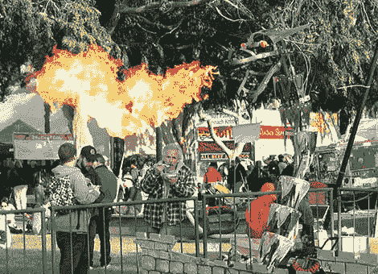

…萨菲拉，那条[喷火龙](http://blog.makezine.com/archive/2010/05/maker_faire_saphira.html)！ *Rar！*

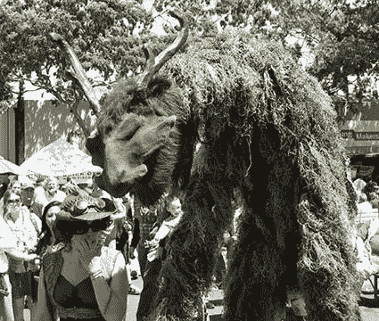

附近，[哈利·杜克]的[沼泽麒麟](http://seabatstudios.blogspot.com/2010/05/swap-kirin-in-cali-again.html)木偶隐约出现在观众面前。我们刚刚发现，麒麟似乎是高效 JPEG 压缩的死敌。

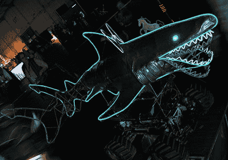

[托德·威廉姆斯的] [陆地鲨鱼](http://www.toddwilliamsdesign.com/Site/El-Wire.html)是一个动画 EL 线框骨架，位于大型[无线电遥控汽车](http://hackaday.com/2010/04/12/warthog-laser-tag/)底盘之上——在黑暗中效果极佳！

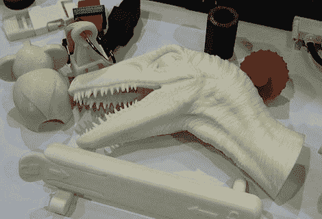

我们好像被咬了一口。这里，有一个*迅猛龙*的头部从一台商用 ABS 挤压 3D 打印机中弹出。

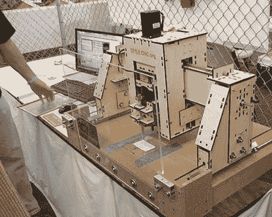

去年年底，我们发布了关于 DIYLILCNC 工厂的消息。当我们最终亲眼看到它时，让我们震惊的是它怎么会是*而不是*里尔。这东西欺负[的记者](http://hackaday.com/2009/08/27/reprap-wedge/)，抢走他们的午饭钱！

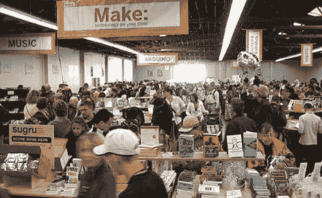

他们甚至在制造商商店里做东西。到底是什么？给你个提示:背面用绿墨水印的。伙计，他们把我们打得落花流水。进去只需要一个视差 [RFID](http://hackaday.com/2009/05/27/catalog-rfid-cat-tracking/) 阅读器，不知何故在花掉相当于关岛国民生产总值之前不能离开。

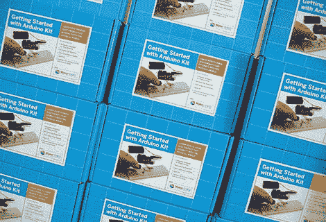

这里的[只是为了博客信誉](http://hackaday.com/2010/05/08/xkcd-takes-a-swipe-at-the-arduino/)。

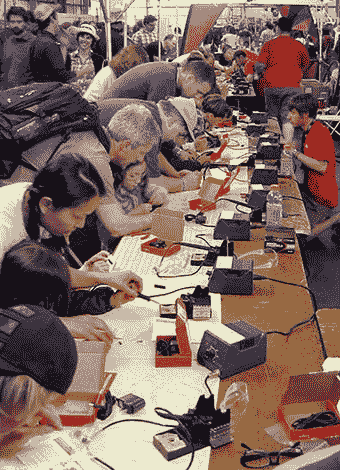

我们再次向 SparkFun 电子公司脱帽致敬。这些人很容易就能从这场演出中获得足够的商品来资助他们的退休。相反，他们教孩子们如何焊接。多酷啊。

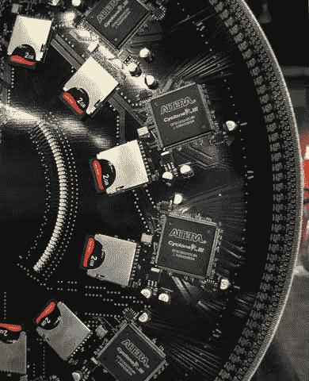

来自 [Art Magnitude 的 ORB v.2](http://artmagnitude.com/orb-v2/) 的 FPGA pr0n，一个大规模的[视觉暂留地球仪](http://hackaday.com/2009/10/15/72-led-persistence-of-vision-globe/)。

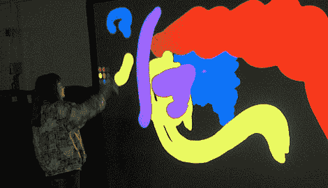

总是有人排队等着玩 Tangile interaction 的[数字涂鸦墙](http://tangibleinteraction.com/gallery/digital_graffiti_wall)。

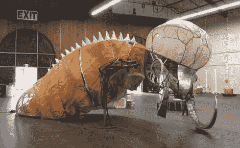

往出口这边走！

如果我们忽略或掩饰了你最喜欢的主题或展示，那可能是我们希望在未来更详细地介绍它。睁大你的眼睛寻找更多的野生动物吧！