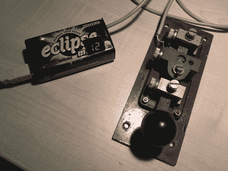

# USB 莫尔斯电码键盘

> 原文：<https://hackaday.com/2010/05/27/usb-morse-code-keyboard/>

寻找练习莫尔斯电码的动力【BenB】造了这个[莫尔斯电码键盘](http://us.cactii.net/~bb/morsekey/)。它使用 USB，由于运行在 ATmega168 上的 V-USB 堆栈，它被视为标准键盘。由于口香糖容器作为一个外壳，该项目以一个干净的外观圆满完成。

他的设计非常简单，你手边的任何莫尔斯键都可以使用。你甚至可以修改你几年前制作的手套编码器。