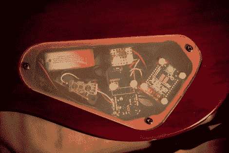

# 在吉他中嵌入加速度计和 XBee

> 原文：<https://hackaday.com/2010/05/28/embedding-an-accelerometer-and-xbee-in-a-guitar/>

[JP Carrascal]通过添加动作控制，同时取消对电线的需求，黑掉了他的吉他。他使用的是双 Arduino 系统，吉他内有一个迷你 Pro，接收器连接到电脑上有一个 Duemilanova。无线是由上面看到的 XBee 模块提供的，Wii 远程加速度计是用于运动感应的。休息后，看看巧妙模糊的运动效果演示。

虽然他添加了一些基于电位计的控制，但也有自动断电功能。[JP]将单声道拾音器替换为立体声拾音器，并使用额外的导线作为开关来激活附加的电子设备。我们想知道他是否也为自己的拾音器上弦或者 T2 制作自己的效果踏板。

 <https://www.youtube.com/embed/xiHNXDWhBQc?version=3&rel=1&showsearch=0&showinfo=1&iv_load_policy=1&fs=1&hl=en-US&autohide=2&wmode=transparent>

 </body> </html>