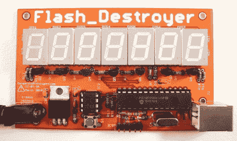

# 俄罗斯轮盘…用于 EEPROM

> 原文：<https://hackaday.com/2010/05/28/russian-roulette-for-eeprom/>

有一把上了膛的枪，但只有一颗子弹。旋转圆筒，指向头部，扣动扳机。直到子弹被使用，一个玩家被干掉，游戏才算结束。这个游戏有一个转折，圆柱体至少有一百万个腔室。

[Flash_Destroyer 正在测试 EEPROM 重写的极限](http://dangerousprototypes.com/2010/05/25/prototype-flash_destroyer/)。它用数据填充那个小小的 8 针芯片，然后验证写了什么。当它发现错误时，游戏就结束了。该芯片额定为 100 万次重写，但当我们写这篇文章时，它已经远远超过 225 万次。我们通常更愿意成为创造者，而不是破坏者，但将这种芯片投入使用也有令人高兴的地方。休息后查看该设备的启动，并点击上面的链接查看进度的流式传输。

 <https://www.youtube.com/embed/Y1k4DchdziI?version=3&rel=1&showsearch=0&showinfo=1&iv_load_policy=1&fs=1&hl=en-US&autohide=2&wmode=transparent>

 
[感谢无人机]
 </body> </html>