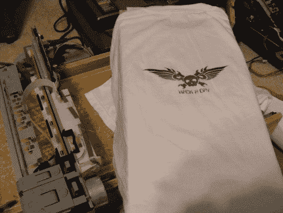

# 操作方法:DIYDTG

> 原文：<https://hackaday.com/2010/06/06/how-to-diydtg/>

对于那些没有意识到的人来说，上面的小缩写代表自己动手[直接成衣](http://en.wikipedia.org/wiki/Direct_to_garment_printing)印刷。通俗地说，就是打印自己的衬衫和设计。[商用 DTG](http://www.google.com/products?hl=en&client=firefox-a&hs=Dou&rls=org.mozilla:en-US:official&q=direct+to+garment+printer&um=1&ie=UTF-8&ei=oe8HTK_8K5HWMJb72LUE&sa=X&oi=product_result_group&ct=title&resnum=3&ved=0CEIQrQQwAg)的价格可能从 5000 美元到 10000 美元不等，这对于只想要几件衬衫的业余爱好者来说是荒谬的。所以你会认为这个技术领域会被黑客攻击到无止境，但我们实际上只看到了[和另外一个完全完成的](http://hackaday.com/2008/09/20/direct-to-garment-printing/)和正在工作的 DIYDTG。所以我们决定尽可能便宜和成功地建造一个 DIYDTG。

我们想借此机会感谢[makemygraphix]的原创设计，因为我们的设计很大程度上是基于他的。和[t 恤论坛](http://www.t-shirtforums.com)，感谢他们的宝贵意见。

对于你自己的 DIYDTG，你需要一些零件，(老实说，我们只是使用了我们身边的东西)
-3/4 英寸碎料板/胶合板/中密度纤维板
-1/2 英寸碎料板/胶合板/中密度纤维板
-1/4 英寸胶合板
-1/2 英寸木螺钉
-24 英寸滚珠轴承抽屉轨道
-废铝(1/16 英寸厚)
-爱普生打印机(下面有更多内容)

你选择的打印机是这次攻击中最关键的部分。我们拆开了一台惠普 DeskJet 3845，佳能 iP1500，Brother MFC420CN，爱普生 Stylus Photo 820 和一台爱普生 Stylus c40。为什么这么多？我们从字面上购买了当地旧货店的每一台打印机(每台 6 美元，其实还不错)，这样读者就不用买了。我们的发现因此；惠普和佳能都在进纸轴上安装了旋转编码器，最终成为一个总 peta，试图对齐并开始工作，这两个都不推荐。“兄弟”是一台一体机，除非每个部分都连接起来，否则无法正常工作，这使得它对于我们的需求来说太大太笨重。这两款爱普生都使用步进电机，非常容易拆卸，并且只有一个易于管理的纸张传感器。跟着爱普生走！(我们最终使用了 C40，因为它有 3 个油墨 CYM 系统，而不是 820 的 5 个 CYMLCLM 系统)。

至于你将在打印机中使用的墨水，我们发现 DTGinks.com 是一个很好的资源。

对于爱普生的软件，我们发现默认驱动程序已经足够好了。有 RIP 软件，但我们找不到任何支持 c40 的软件。我们将推荐 [SSC 实用程序](http://www.ssclg.com/epsone.shtml)。允许您快速轻松地向打印机谎报墨盒的数量、种类和更换情况(仅适用于爱普生)。

对于工具，我们推荐以下工具:
-卷尺
-角尺
-笔/粉线
-台锯
-圆锯
-竖锯
-Dremel
-钻床/钻头(和各种钻头)
-砂纸/锉刀

我们从拆开打印机开始。每个打印机都不一样，所以我们不能给你细节，但它的过程相对简单。到最后，你只需要头和它的托架，进纸电机和它的轴，以及电源。

你需要如下切割木头，(应该注意，这些与我们实际使用的略有不同)
3/4 英寸，
1 x 26 英寸乘 11 又 1/2 英寸。
1×26 英寸×10 英寸。

对于 1/2 英寸，
2 x 26 英寸乘 5 英寸，
2 x 26 英寸乘 1 又 3/4 英寸。

首先将两块 26 英寸×5 英寸的板夹在一起。现在，在距离末端 6 英寸，距离底部 2 英寸和 3/8 英寸的地方，同时钻一个 5/8 英寸的孔穿过两块板。这是进纸轴的位置。

这里是一个棘手的部分，金属轨道。我们将外部部分从顶部 3/4 英寸安装在 26 英寸×5 英寸(你选择哪个并不重要)的一块上，并使轨道的止点/背面/末端与板的末端齐平(这不是很重要的优先事项)。并且轨道的内部在 26”x1 和 3/4”片段中的一个上从顶部开始 1”和 1/8”。

通常情况下，我们建议您使用金属“L”支架来固定木头的角部，但是只要您预先钻一个比您的螺钉略小的孔，您就没事了(我们也埋头钻我们的大多数螺钉，但这是可选的)。将两个 26”x1 和 3/4”连接到 26”X10”上。对两个 26 英寸 x5 英寸和 26 英寸 x11 和 1/2 英寸的零件进行同样的操作。

所有这一切都有点棘手，所以这里有一张图片来帮助。对于那些想知道的人来说，在这张图片中，顶部托盘向你滚动。

一张没有顶部托盘的照片，你可以看到我们的轴不够长，所以放了一个简单的 2”x3”的东西。无论顶部托盘是否进入，确保轴自由旋转且无卡滞。

下一个有趣的部分是安装驱动电机。它需要紧贴轴的齿轮，但又不能太紧，以免与木头摩擦。它还需要有一种方法来防止轴“弹出”。我们相对简单地解决了这两个问题。

拿起你的组件，取下最上面的架子，把它侧着放好。将电机放置在将安装在 26”X5”工件顶部/内部的位置。在轴下降，让一切都对齐，并围绕电机基地画一个圆圈。使用直边和切线，你可以近似你的圆心。

用一个大孔锯把它锯出来(不一定要完美)。打磨/锉平它，这样电机就可以轻松安装，而不会弯曲任何引脚。我们将一块 1”x3”的铝片铆接到电机上，使安装变得更加容易。

在你的轴下降，并确保一切排队。最后，为了防止轴滑入，我们使用了多余打印机部件的垫圈和 C 形夹(你没有扔掉，对吧？)在另一个 26 英寸×5 英寸的工件上。为了避免轴滑出，我们拿了一块 1 X10 英寸的铝片，将其弯曲成“n”形，为轴钻了一个孔，并使用了额外打印机零件上的切割弹簧。一张图抵得上 1000 个字，

有我在，我们就快完成了！

你现在需要修改打印机托架，只需切断纸张通过的槽，

你要把它安装在大约 6 英寸后面的两个 26 英寸×5 英寸的部件上面。我们很幸运，发现托架上的两个先前的安装螺丝孔完全吻合，但是其他打印机您可能需要弯曲或自己制作。(这张图是我们做俏皮的“_n_”括号之前拍的)。

现在我们做了一个模板，这是你的衬衫要穿的。它是如何制作的真的取决于你，我们甚至对我们的设计不完全满意，所以到处玩，找到最好的作品。我们的是 24 英寸×9 英寸和 1/2 英寸的 1/4 英寸胶合板，安装在两块 20 英寸×2 英寸和 7/8 英寸的 1/2 英寸胶合板的顶部。身高的测量完全取决于你头部的高度。对于那些想知道的人来说，我们从来没有得到一个关于衬衫实际上应该离头部多远的答案，但是我们已经发现大约 1/8″就足够了。(你在我们的压板上看到的“腿”后来被去掉了。)

安装电源，并将其与电机一起焊接到驱动板上。

现在有一部分我们忽略了，直到现在。那就是进纸传感器(还记得我们之前提到的那个传感器吗？).那是因为我们花了 3 天时间试图让那个吸盘和我们的压板一起工作。我们尝试了一切，不同的时间和压板的位置，甚至编程一个 MCU 来试图欺骗打印机认为压板是纸。最后，我们就这样分手了。

偶然地。

而且成功了(不真的！)我们需要一点时间来触发传感器，但这是手动的，但我们从未出现过像压印板那样的印刷错误。(如下图所示，这是我们触发进纸传感器的一次“磁带”尝试，大约 50 次中有 1 次成功)。

通电，

发送打印作业，手动触发进纸传感器，我们就可以打印了！

这只是一个简短的视频，如果它在行动，最值得注意的是，你可以看到我们的手触发进纸传感器。橙色是测试打印，因为你可以看到，如果你的压盘不是 100%平坦和水平相对于头部，你会得到一些污迹和一般打印错误。这件白衬衫是我们之前做的一个完美(嗯，测试)的印花。

[https://www.youtube.com/embed/qxYG-ZiyfF8?version=3&rel=1&showsearch=0&showinfo=1&iv_load_policy=1&fs=1&hl=en-US&autohide=2&wmode=transparent](https://www.youtube.com/embed/qxYG-ZiyfF8?version=3&rel=1&showsearch=0&showinfo=1&iv_load_policy=1&fs=1&hl=en-US&autohide=2&wmode=transparent)

(是的，我们知道视频早些时候被屏蔽了。我们已经重新上传了，谢谢您的耐心；现在应该可以了。)

*免责声明，使用工具时没有正确保护耳朵和眼睛可能会导致去医院就诊。民政署对任何损失都不负任何责任。要聪明，要安全。*