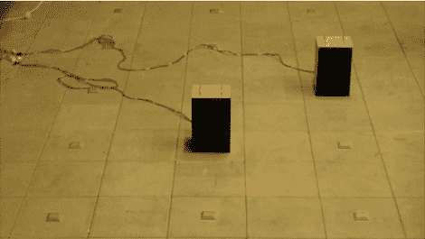

# 移动扬声器以混合音轨

> 原文：<https://hackaday.com/2010/05/30/moving-speakers-to-mix-audio-tracks/>

[这些扬声器](http://vimeo.com/10481179)播放不同的音轨，取决于它们坐在哪个橙色方块的上面。它们是 RFID 感知的，橙色的瓷砖是标签。如果你厌倦了一个曲目，只需将扬声器移到另一个，或者将扬声器放在一起播放同一首歌曲。我们确信这里有一个适合我们的项目，只是需要一些思考来找出我们想要用它做什么。但是这个概念确实很吸引人。休息之后请看视频演示。

[https://player.vimeo.com/video/10481179](https://player.vimeo.com/video/10481179)

[谢谢费迪南]