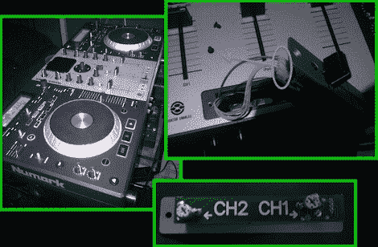

# 交叉渐变曲线调整

> 原文：<https://hackaday.com/2010/05/30/crossfade-curve-tweaking/>

厌倦了他的 Numark MIXDECK 上交叉渐变的令人失望的表现，[dj JD]将其打开，[使交叉渐变曲线可调](http://www.djjdpro.com/guides/mixdeck_fader.html)。这是一个超级简单的黑客技术，只需在交叉渐变滑块中引入两个 100k 的微调点。这一改变导致当前频道的音量更高，直到滑块更靠近中心。增加的调整功能可能很好，因为板上有两个旋钮，但[JD 的]方法使他的设备看起来很普通。这是不是更精致版的[电路弯曲](http://hackaday.com/2010/01/17/hackaday-links-january-17th-2010/)？