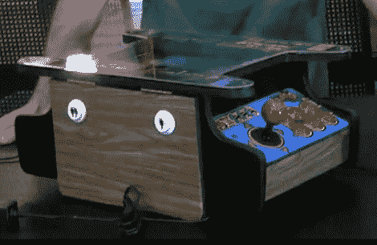

# 儿童尺寸的鸡尾酒柜

> 原文：<https://hackaday.com/2010/05/30/child-sized-cocktail-cabinets/>

[山姆·塞德]给我们留下了一行关于他的新街机作品的文字。我们喜欢他的打卡游戏，他使用[一个打卡假人作为游戏控制器](http://hackaday.com/2009/05/18/punchy-punchout-improved/)。这一次，他制作了一些迷你鸡尾酒风格的 MAME 橱柜。他将屏幕从上网本上取下，面朝上放在丙烯酸边框下面。正如我们对任何[品质的鸡尾酒柜](http://hackaday.com/2009/09/09/in-depth-mame-cocktail-cabinet-build/)所期望的那样，两边都有两个玩家控制。控制面板通过现在熟悉的 iPac 板连接，底部有点不完整，但这并没有减少我们在家里的咖啡桌上看到其中一个的需求。休息后，请查看演示和内部零件的概要。

 <https://www.youtube.com/embed/1N5rII07TEs?version=3&rel=1&showsearch=0&showinfo=1&iv_load_policy=1&fs=1&hl=en-US&autohide=2&wmode=transparent>

 
示范
 <iframe class="youtube-player" width="800" height="480" src="https://www.youtube.com/embed/DuT_CHWoQ_M?version=3&amp;rel=1&amp;showsearch=0&amp;showinfo=1&amp;iv_load_policy=1&amp;fs=1&amp;hl=en-US&amp;autohide=2&amp;wmode=transparent" allowfullscreen="true" style="border:0;" sandbox="allow-scripts allow-same-origin allow-popups allow-presentation"/> 
胆量走过
 </body> </html>