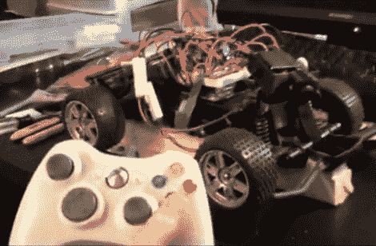

# 遥控汽车嘲弄人类最好的朋友

> 原文：<https://hackaday.com/2010/06/02/rc-car-taunts-mans-best-friend/>

[Arkos]挖掉了他童年时的一辆遥控汽车的内脏，把它变成了一个模仿狗的遥控平台。Arduino 用蓝牙模块取代了原来的电路，实现了连接。他使用 Xbox 360 控制器，并增加了一个小扬声器作为警报器。但是对于我们的钱来说，这是一个摄像头。它将视频流回笔记本电脑，因为它安装在几个伺服系统上，左杆控制镜头的方向。下一个版本应该会取代 Arduino，成为一个独立的微控制器，但是他的第一个原型是令人高兴的。休息后，看 Fido 惊恐地奔跑。

 <https://www.youtube.com/embed/BstbG4UrVfQ?version=3&rel=1&showsearch=0&showinfo=1&iv_load_policy=1&fs=1&hl=en-US&autohide=2&wmode=transparent>

 </body> </html>