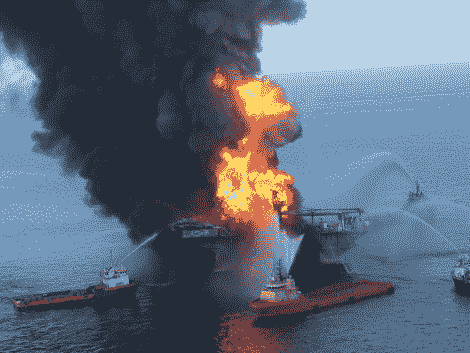

# BP 石油失误

> 原文：<https://hackaday.com/2010/06/05/bp-oil-blunders/>

我们今天从我们的好朋友[Jonny Dryer]那里收到了一个非常有趣的“黑客”，它确实让我们思考了一下，但首先要有一点背景知识。

对于那些只住在山顶盒子里的人来说(我们知道你是谁)，在路易斯安那州威尼斯东南 40 英里的地方，英国石油公司的石油钻塔发生了爆炸。事故发生一个月后，卡罗尔·布朗纳称之为“可能是最大的环境灾难”——[。](http://www.msnbc.msn.com/id/36947751)

而且石油[还在喷涌](http://news.yahoo.com/s/ynews/20100524/sc_ynews/ynews_sc2199;_ylt=AoVlG.KTu3XFxlQsYg.IxQln.6F4;_ylu=X3oDMTE2MmhodGxxBHBvcwMyBHNlYwN5bl9mZWF0dXJlZARzbGsDcGhvdG9zb2lsc3By)。现在，我们不是要批评这件事的处理方式；不，我们把它[留给了](http://www.huffingtonpost.com/2010/05/11/colbert-on-oil-containmen_n_571499.html)T4 的专家。

回到我们的观点，[Jonny Dryer's]给我们发来了他用液氮减缓石油泄漏的计划，如果你问我们的话，那真是天才。我们想知道其他读者提出了什么可能的解决方案？请在评论中分享你对这种情况的看法。