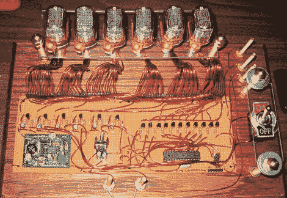

# 谢妮显示器带来更多布线疯狂

> 原文：<https://hackaday.com/2010/06/03/nixie-display-brings-more-wiring-madness/>

蒂姆·安德森[用涂有环氧树脂的电线制作了这个数码管显示器](http://thetransistor.com/projects/tims-nixie-display/)。他当然是在给[绕线 LED 显示屏](http://hackaday.com/2010/06/03/wire-wrapping-an-led-matrix/)一个机会。在焊接之前，他用 Dremel 磨掉了每根电线末端的环氧树脂。我们认为你可以通过环氧树脂焊接，但也许不行。这比绕线容易吗？我们敢打赌，由于电压的原因，绕线在这里是不可行的。左边的电路板是电子管的 180V 电源，右边是运行 Arduino 引导程序的 AVR 芯片。休息之后，有一个通过串行连接下载数据的简短演示。[Tim]还计划在将来的某个时候给这个系统添加一个原子钟模块。