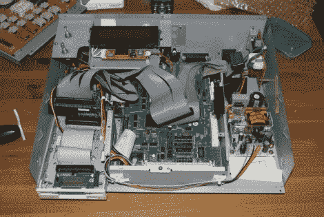

# 向旧序列器添加紧凑型闪存

> 原文：<https://hackaday.com/2010/06/05/adding-compact-flash-to-an-old-sequencer/>

[Shoji]有一个心爱的音序器，十年前就停产了。不幸的是，存储选项也过时了 10 年，因为 SCSI 是存储他的循环的常用选项。他使用一系列适配器给他的 Akai MPC-2000 Classic 增加了紧凑型闪存存储。该板有一个用于 25 针 SCSI 的连接器，他将其连接到 25 针到 50 针 SCSI 适配器。从那里，他将 SCSI 连接到 IDE 板，然后将 IDE 连接到 CF。[Akai](http://www.loopers-delight.com/tools/akai/MPC2000/MPC2000.html)Classic 的后续版本在左上角有软盘驱动器，所以他使用这种方法安装 CF 插槽。现在他有了足够的储物空间，而活套的外观几乎没有变化。