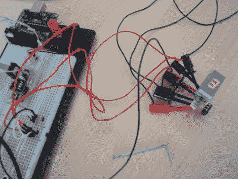

# 摩托车当前档位指示器

> 原文：<https://hackaday.com/2010/06/04/motorcycle-current-gear-indicator/>

[瓦西里斯·帕帕尼科拉乌]刚刚为一辆摩托车制造好了一个档位指示器[。与我们已经看到的一些](http://www.electronics-lab.com/projects/automotive/006/index.html)[其他车辆信息显示](http://hackaday.com/2010/05/05/vehicle-information-display-hacks/)相比，这是一个非常简单的实现。你应该能够在不倾家荡产的情况下建造和安装自己的系统。ATtiny25 微控制器从几个霍尔效应传感器和空档开关读取数据，然后在 7 段显示器上显示当前档位。

换挡杆上有一块磁铁，换挡杆上有两个霍尔效应传感器，用于“升档”和“降档”换挡。AVR 芯片会跟踪这些，甚至会在您关闭自行车时将最后的位置存储在 EEPROM 中。如果该设备不知何故偏离了轨道，它会在你下次换到空档时自动重新校准，这要感谢自行车的空档传感器开关。