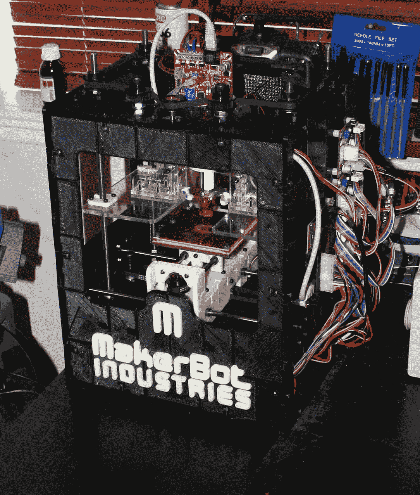

# 3D 打印 MakerBot

> 原文：<https://hackaday.com/2010/06/05/3d-printed-makerbot/>

[Webca]用他的 MakerBot 做了一个 [3D 打印的 MakerBot](http://www.thingiverse.com/thing:3285) 。使用五磅塑料，这个设计取代了所有用来制作普通 MakerBot 的胶合板。这补充了已经在 [Thingiverse](http://www.thingiverse.com/) 上的 3D 打印挤压机、dinos 和其他部件的现有设计。3D 打印史上一个有趣的里程碑。在我们做了一个孟德尔和大量的[黑客日徽章](http://hackaday.com/2010/01/12/how-to-make-a-printable-ces-badge/)之后，我们可能会做一个。我们也期待着人们对设计的改进，例如使用更少的塑料或参数化设计来制作一个真正大(或小)的 MakerBot。