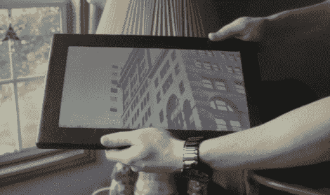

# 碳纤维外壳的 Windows 7 平板电脑

> 原文：<https://hackaday.com/2010/06/08/windows-7-tablet-in-a-carbon-fiber-case/>

如果你不是苹果的忠实粉丝，追随 iPad 就意味着你不会使用新的硬件。厌倦了被冷落，【slam pana】[为自己打造了一台 Windows 7 平板电脑](http://carbontablet.blogspot.com/)。他从一台 MSI X320 上抓起主板和 13.4 英寸的屏幕，添加了电阻式触摸屏、USB 集线器、内部 WiFi 和蓝牙，然后用定制的碳壳包裹起来。它很小，很光滑，价格在 600-700 美元左右。休息后观看演示时开始流口水。

[感谢 Rich via [Gizmag](http://www.gizmag.com/carbon-diy-touchscreen-tablet/15331/)