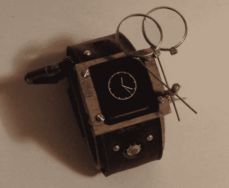

# 你真的想戴的 Arduino 手表

> 原文：<https://hackaday.com/2010/06/08/an-arduino-watch-you-would-actually-want-to-wear/>

皮革制品，铜管，易于使用的小包装。现在那块是一块漂亮的 [Arduino 手表。](http://www.optimizedforce.com/2010/06/steampunk-edition.html)【马修·加滕】改装了他的旧 Arduino 手表，给了[我们渴望的细节](http://www.instructables.com/id/Arduino-Watch-Build-Instructions/)。

以前，我们仅有的是一段视频和一只相当不起眼的手表的几张照片。但现在我们知道它有温度，测距和轨迹球输入，同时显示时间，游戏和更多 128 x 128 像素有机发光二极管 16 位显示器。我们有没有提到更吸引人的[蒸汽朋克案](http://hackaday.com/?s=steampunk)？